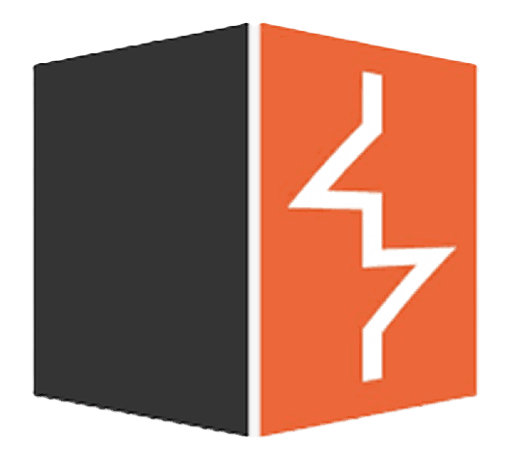

  

<h1 align="center">Hello &nbsp; , I'm Yassine Moumoun</h1>

  Cybersecurity • Machine Learning • AI • Software Engineering

  <h2>🌐 Connect with Me</h2>
  
Find me on the platforms below

| CV | LinkedIn | GitHub | YouTube |
| --- | --- | --- | --- |
|  |  |  |  |

| Instagram | Facebook | Twitter | Reddit |
| --- | --- | --- | --- |
|  |  |  |  |

  

<!-- ─────────────────────────────────────────────── -->
<!--                   ABOUT ME                      -->
<!-- ─────────────────────────────────────────────── -->

<h2><picture></picture>  About Me</h2>

<picture>
  
</picture>

 

- 👋 Hi, I'm **Yassine MOUMOUN** from Morocco <picture></picture>
- 🎓 I’m a university student specializing in **Computer Science & Cybersecurity**  
- 🛡 Actively building a strong foundation in cyber defense, software engineering, and AI/ML  
- 🤖 Exploring Artificial Intelligence & Machine Learning through personal projects  
- 📚 Constantly improving through research, practice, and hands-on development  
- 🔐 Interested in cybersecurity fundamentals, network & system security, applied ML  
- 💼 Looking for a **4-month internship in France (September 2026)**  

 </a>

 
<h3 align="center">Programming Languages</h3>

<table>
<tr>
  <td align="center"> Java</td>
  <td align="center"> C</td>
  <td align="center"> C++</td>
  <td align="center" style="border: none;">  Python </td>
  <td align="center"> Jupyter</td>
</tr>
</table>

<h3 align="center">Frontend Development</h3>

<table>
<tr>
  <td align="center"> HTML5</td>
  <td align="center"> CSS3</td>
  <td align="center" style="border: none;"> JavaScript</td>
  <td align="center"> PHP</td>
</tr>
</table>

<h3 align="center">AI / Machine Learning</h3>

<table>
<tr>
  <td align="center"> OpenCV</td>
  <td align="center"> PyTorch</td>
  <td align="center"> Pandas</td>
  <td align="center" style="border: none;"> TensorFlow</td></tr>
</table>

<h3 align="center">Databases</h3>

<table>
<tr>
  <td align="center"> PostgreSQL</td>
  <td align="center" style="border: none;"> MySQL</td>   
  <td align="center">   Oracle DB</td>
  <td align="center"> MariaDB</td>
</tr>
</table>

<h3 align="center">Cybersecurity Tools</h3>

<table>
<tr>
  <td align="center"> Linux</td>
  <td align="center"> Kali Linux</td>
  <td align="center"> BurpSuite</td>
  <td align="center"> Nmap</td>
</tr>
</table>

<h3 align="center">AI Tools & Prompt Engineering</h3>

<table>
<tr>
  <td align="center"> ChatGPT</td>
  <td align="center"> Claude</td>
  <td align="center" style="border: none;"> Google Gemini</td>
  <td align="center"> Blackbox AI</td>
</tr>
</table>

